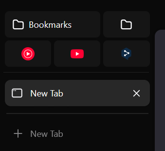
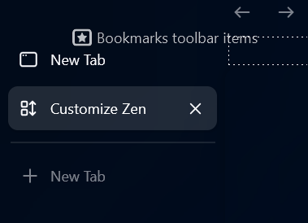

The userChrome.css file is stored in the Zen Profile folder, normally located under %appdata%\zen\Profiles\xy\chrome

## Clean Bookmarks
Show bookmarks in the sidebar. By default bookmarks are shown in three columns. Bookmarks with labels have a width of two columns. 

To use this "mod" you need to edit the `userChrome.css` and paste the code from `clean_bookmarks.css` into it. In Zen you need to enable `Show bookmarks toolbar` and go into the `Customize Toolbar` menu and move the `Bookmarks toolbar items` to your desired location in the sidebar.

You can change the amount of columns by editing `clean_bookmarks.css` on line 16 with `grid-template-columns` and replace 3 with the desired number.

## Forked CSS
[Natsumi](https://github.com/greeeen-dev/natsumi-browser/tree/main)

[Floating Status Bar](https://github.com/AmirhBeigi/zen-floating-statusbar)

[Quietify](https://github.com/wysh3/Zen-Mods/tree/main/Quietify)

## Configuration
To live edit it go to about:config in Zen and set devtools.debugger.remote-enabled to true
Afterwards the shortcut Ctrl + Shift + Alt + I can be used to open the browser devtools

[Mod settings](https://docs.zen-browser.app/themes-store/themes-marketplace-preferences)